<h2 align="center">Stack tecnológico</h2>

<h3>Lenguajes y frameworks</h3>

<a href="https://skillicons.dev">
<picture>

</picture>
</a>

<h3>Ecosistema SAP</h3>

<h3>Bases de datos</h3>

<a href="https://skillicons.dev">
<picture>
<!--<source media="(prefers-color-scheme: dark)" srcset="https://skillicons.dev/icons?i=postgres,mysql,mongodb&theme=dark"/>-->

</picture>
</a>

<h3>Inteligencia artificial</h3>

